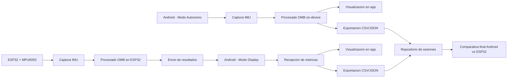

# Esquemas Visuales del TFG

## 1) Arquitectura general


## 2) Flujo Android (captura -> procesado -> visualizacion)
```mermaid
flowchart TD
    S[Inicio sesion] --> C[Captura sensores<br/>acc + gyro (+ rotation vector)]
    C --> T[Normalizar timestamps<br/>y fs real]
    T --> W{Ventana suficiente?}
    W -- No --> Q[Modo rapido diagnostico<br/>30s]
    W -- Si --> P[Procesado OMB<br/>Welch + (2*pi*f)^4 + Hs/Tz/Tc]
    Q --> V[Visualizacion parcial]
    P --> V[Visualizacion robusta]
    V --> X[Exportar sesion<br/>CSV + resumen JSON/MD]
    X --> F[Fin]
```

## 3) Comparativa Android vs ESP32

```mermaid
flowchart TD
    P0[Definir prueba fisica unica] --> P1[Ejecutar Android]
    P0 --> P2[Ejecutar ESP32]

    P1 --> M1[Obtener Hs/Tz/Tc + fs + ruido + latencia + consumo]
    P2 --> M2[Obtener Hs/Tz/Tc + fs + ruido + latencia + consumo]

    M1 --> C1[Unificar formato de resultados]
    M2 --> C1

    C1 --> T[Tabla comparativa]
    T --> G[Graficas comparativas]
    G --> R[Conclusiones:<br/>viabilidad, precision, limites]
```


